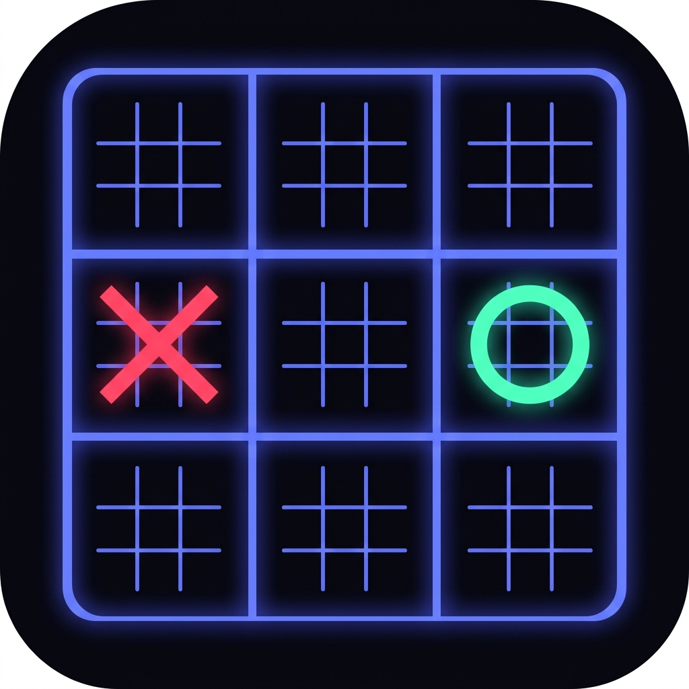

# 🎮 Velha 2.0 — Ultimate Tic-Tac-Toe

<div align="center">



**Um jogo de Velha do Mal — 9 mini-tabuleiros dentro de 1 tabuleiro grande.**

[](https://www.rust-lang.org/)
[](https://github.com/emilk/egui)
[](LICENSE)
[](.)

</div>

---

> **⚠️ Aviso importante:**
> Este projeto é **vibecoding** — foi construído por divertimento, entre amigos, sem compromisso com perfeição.
> Pode ter bug. Pode ter código feio. Pode ter comentário engraçado no lugar errado.
> Se você esperava código de produção enterprise: errou o repositório. 😄
> Se você quer se divertir jogando Velha com seus amigos: **seja bem-vindo!**

---

## 📖 O que é isso?

**Velha 2.0** é uma versão turbinada da velha clássica: o **Ultimate Tic-Tac-Toe**.

A regra é simples e diabólica ao mesmo tempo:

- O tabuleiro tem **9 mini-tabuleiros** organizados em uma grade 3×3
- Você joga numa célula de um mini-tabuleiro → isso **determina em qual mini-tabuleiro** o próximo jogador deve jogar
- Para vencer um mini-tabuleiro: faça uma linha de 3 (igual à velha normal)
- Para vencer o jogo: vença **3 mini-tabuleiros em linha** no tabuleiro grande
- Se o mini-tabuleiro indicado já foi ganho: o jogador pode jogar **em qualquer um aberto**

É a velha. Mas com traição embutida.

---

## ✨ Funcionalidades

- 🎮 **Multiplayer local** — dois jogadores no mesmo teclado/mouse
- 🤖 **vs CPU** em 4 níveis de dificuldade:
  - `Noob` — joga quase aleatório (20% de chance de fazer uma jogada boa por acidente)
  - `Jogadora` — bloqueia e ataca quando pode
  - `Master` — Minimax com Alpha-Beta, profundidade 4
  - `Killer 💀` — Minimax com Alpha-Beta, profundidade 6 + heurística macro+micro
- 💾 **Histórico de partidas** salvo em SQLite local
- 🎨 **Interface dark** com tema neon, fonte Garet, animações de borda ativa
- 🖥️ **Multiplataforma** — Linux, macOS, Windows

---

## 🗂️ Estrutura do Projeto

```
velha2/
├── src/
│   ├── main.rs              # Ponto de entrada
│   ├── app.rs               # Orquestrador central de telas e estado
│   │
│   ├── game/                # Domínio puro (sem UI, sem banco, sem rede)
│   │   ├── board.rs         # Tabuleiro e lógica de jogada
│   │   ├── rules.rs         # Vitória, empate, jogadas válidas
│   │   └── types.rs         # Player, Cell, QuadState, GameResult
│   │
│   ├── ai/                  # Motor de IA
│   │   ├── minimax.rs       # Minimax com poda Alpha-Beta
│   │   ├── heuristic.rs     # Avaliação de tabuleiro (Master/Killer)
│   │   └── levels.rs        # Dispatcher de nível de dificuldade
│   │
│   ├── storage/             # Persistência SQLite
│   │   ├── db.rs            # Conexão e migrations
│   │   ├── profile.rs       # CRUD de perfis
│   │   └── history.rs       # Histórico de partidas
│   │
│   ├── network/             # Networking P2P (em desenvolvimento)
│   │   ├── protocol.rs      # Protocolo de mensagens
│   │   ├── session.rs       # Gerenciamento de sessão
│   │   └── peer.rs          # Estado de conexão
│   │
│   └── ui/                  # Interface egui
│       ├── theme.rs         # Design system (cores, espaçamentos, fontes)
│       ├── components/      # Widgets reutilizáveis
│       │   ├── board_widget.rs  # Tabuleiro 9x9 renderizado
│       │   └── player_card.rs   # Card do jogador
│       └── screens/         # Telas da aplicação
│           ├── main_menu.rs
│           ├── lobby.rs
│           ├── game_screen.rs
│           └── history.rs
│
├── assets/
│   ├── fonts/               # Fonte Garet embutida no binário
│   └── velha2.png           # Ícone do app
│
├── Cargo.toml
├── install.sh               # Script de instalação Linux
├── velha2.desktop           # Entrada no menu Linux
└── README.md
```

---

## 🛠️ Pré-requisitos

### Rust (todas as plataformas)

Você precisa do **Rust 1.70 ou superior**. Instale pelo [rustup](https://rustup.rs/):

```bash
curl --proto '=https' --tlsv1.2 -sSf https://sh.rustup.rs | sh
```

Depois de instalar, configure o toolchain estável:

```bash
rustup default stable
```

---

## 🐧 Linux

### Dependências de sistema

```bash
# Ubuntu / Debian / Linux Mint / Pop!_OS
sudo apt install -y \
  libxcb-render0-dev libxcb-shape0-dev libxcb-xfixes0-dev \
  libxkbcommon-dev libssl-dev pkg-config libfontconfig1-dev

# Fedora / RHEL / CentOS
sudo dnf install -y \
  libxcb-devel libxkbcommon-devel openssl-devel fontconfig-devel

# Arch Linux / Manjaro
sudo pacman -S libxcb libxkbcommon openssl fontconfig
```

### Compilar e rodar

```bash
# Clone o repositório
git clone https://github.com/seu-usuario/velha2.git
cd velha2

# Rodar em modo desenvolvimento
cargo run

# Compilar binário otimizado
cargo build --release

# Rodar o binário compilado
./target/release/velha2
```

### Instalar como app desktop (ícone no menu)

```bash
# Instalação local (sem sudo — recomendado)
bash install.sh --local

# Instalação global (requer senha de administrador)
bash install.sh

# Desinstalar
bash install.sh --uninstall --local
```

Após instalar, o jogo aparece no menu de aplicativos do GNOME, KDE ou qualquer DE compatível com `.desktop`.

---

## 🍎 macOS

### Dependências

No macOS, você só precisa do Rust. As libs de sistema vêm com o Xcode Command Line Tools:

```bash
xcode-select --install
```

### Compilar e rodar

```bash
git clone https://github.com/seu-usuario/velha2.git
cd velha2

# Rodar direto
cargo run

# Compilar release
cargo build --release

# Rodar o binário
./target/release/velha2
```

### Criar um .app (opcional)

Se quiser um pacote `.app` clicável no Finder, instale o `cargo-bundle`:

```bash
cargo install cargo-bundle
cargo bundle --release
# → gera: target/release/bundle/osx/Velha 2.0.app
```

Arraste o `.app` para a pasta Aplicativos e pronto.

---

## 🪟 Windows 10 e 11

### Dependências

No Windows, você vai precisar de:

1. **Rust** — baixe o instalador em [rustup.rs](https://rustup.rs/) e execute o `.exe`
2. **Visual Studio Build Tools** (o Rust pede isso automaticamente na instalação):
   - Durante o `rustup-init.exe`, escolha instalar o MSVC toolchain
   - OU instale o [Visual Studio Build Tools](https://visualstudio.microsoft.com/visual-cpp-build-tools/) separadamente, marcando "C++ build tools"

Não precisa instalar mais nada — o `rusqlite` compila o SQLite embutido automaticamente.

### Compilar e rodar (PowerShell ou CMD)

```powershell
# Clone o repositório
git clone https://github.com/seu-usuario/velha2.git
cd velha2

# Rodar direto
cargo run

# Compilar release
cargo build --release

# Rodar o binário
.\target\release\velha2.exe
```

### Criar um atalho na Área de Trabalho

1. Navegue até `target\release\velha2.exe`
2. Clique com o botão direito → `Enviar para` → `Área de trabalho (criar atalho)`
3. No atalho criado, clique com o botão direito → `Propriedades` → `Alterar ícone`
4. Aponte para o arquivo `assets\velha2.png`

> **Nota Windows:** Se aparecer o aviso "Windows protegeu seu computador", clique em "Mais informações" → "Executar assim mesmo". Isso acontece porque o binário não é assinado digitalmente.

---

## 🎮 Como jogar

### Modos disponíveis

| Modo | Descrição |
|------|-----------|
| **Local** | Dois jogadores no mesmo PC, alternando mouse |
| **vs CPU** | Você contra a IA nos níveis Noob, Jogadora, Master ou Killer |
| **P2P** | Em desenvolvimento 🚧 |

### Regras do Ultimate Tic-Tac-Toe

1. X sempre começa
2. Clique em qualquer célula disponível no quadrante ativo (destacado com borda azul brilhante)
3. A célula onde você jogou determina em qual quadrante o oponente deve jogar
4. Se o quadrante-destino já foi ganho ou empatado, o oponente escolhe qualquer quadrante aberto
5. Vença 3 quadrantes em linha para ganhar o jogo

---

## 🗃️ Onde ficam os dados salvos

O jogo salva o histórico de partidas automaticamente:

| Platform | Caminho |
|----------|---------|
| Linux | `~/.local/share/velha2/data.db` |
| macOS | `~/Library/Application Support/velha2/data.db` |
| Windows | `%APPDATA%\velha2\data.db` |

---

## 🧱 Stack Técnica

| Componente | Tecnologia |
|---|---|
| Linguagem | Rust 1.70+ |
| UI | [egui](https://github.com/emilk/egui) + [eframe](https://github.com/emilk/egui/tree/master/crates/eframe) 0.27 |
| Banco de dados | SQLite via [rusqlite](https://github.com/rusqlite/rusqlite) (bundled) |
| Fonte | [Garet](https://fontesk.com/garet-typeface/) — embutida no binário |
| IA | Minimax com poda Alpha-Beta (Rust puro) |
| Serialização | serde + serde_json |
| Diretórios | [directories](https://github.com/dirs-dev/directories-rs) |

---

## 🤝 Sobre este projeto

Este projeto nasceu de uma sessão de **vibecoding** — aquele momento em que você coloca uma playlist boa, abre o editor e começa a construir algo só pelo prazer de construir.

Não tem deadline. Não tem cliente. Não tem sprint. Tem só a gente, o compilador do Rust reclamando da gente, e a satisfação de ver o tabuleiro aparecer na tela.

Se você quiser contribuir: **fique à vontade**. Abre uma issue, manda um PR, ou só abre o jogo e manda uma screenshot perdendo pro Killer.

---

## 📝 Licença

MIT — faça o que quiser, só não culpe a gente se o Killer te destruir.

---

<div align="center">

*Feito com Rust 🦀, egui 🎨, e muito café ☕*

*"A gente refatora depois." — Adam Sandler, provavelmente*

</div>
