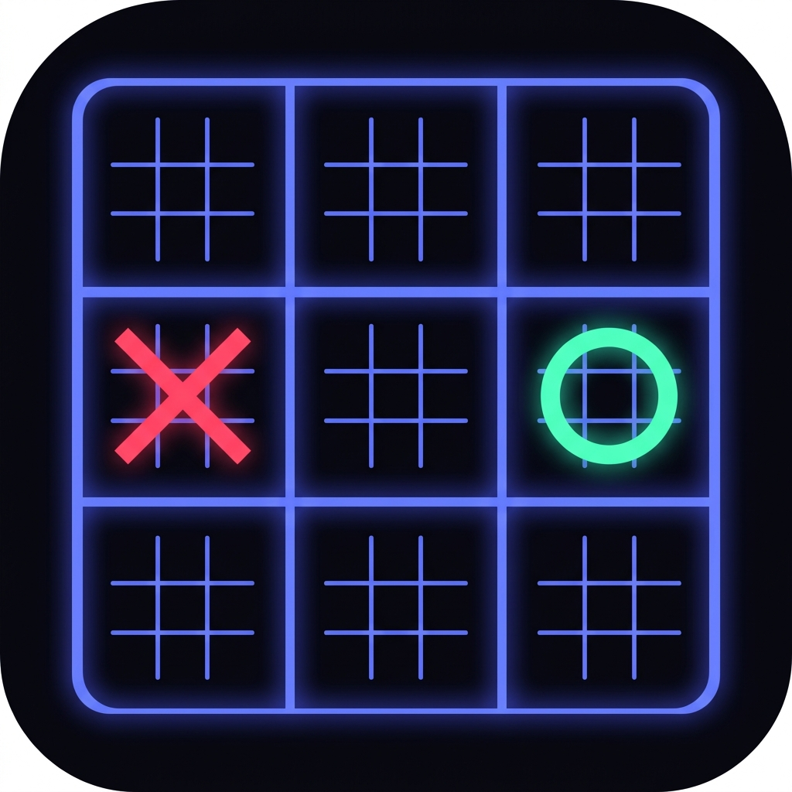

# 🎮 Ultimate Tic-Tac-Toe

<div align="center">



**Uma versão estratégica e impiedosa do Jogo da Velha — 9 mini-tabuleiros aninhados dentro de um grande tabuleiro principal.**

[](https://www.rust-lang.org/)
[](https://github.com/emilk/egui)
[](LICENSE)
[](.)

</div>

---

> **⚠️ Aviso Importante:**
> Este projeto foi concebido no espírito do **vibecoding** — desenvolvido puramente por diversão e camaradagem, sem qualquer pretensão de perfeição técnica. É provável que você encontre pequenos bugs, soluções de código pouco convencionais ou comentários humorísticos dispersos. Se você busca um projeto de nível corporativo e rigor industrial, este talvez não seja o repositório ideal. 😄 No entanto, se o seu objetivo é se divertir jogando com seus amigos, **seja muitíssimo bem-vindo!**

---

## 📖 O que é isso?

**Ultimate Tic-Tac-Toe** é uma variante avançada e profundamente estratégica do clássico Jogo da Velha. A dinâmica é ao mesmo tempo simples e instigante:

- O tabuleiro é composto por **9 mini-tabuleiros** organizados em uma grade maior de 3×3.
- A célula escolhida em sua jogada no mini-tabuleiro **determina a região (mini-tabuleiro)** em que o oponente será obrigado a realizar a próxima jogada.
- Para conquistar um mini-tabuleiro, complete uma linha de três símbolos (como no Jogo da Velha clássico).
- Para alcançar a vitória definitiva, vença **3 mini-tabuleiros alinhados** na grade principal.
- Caso a jogada anterior direcione a partida para um mini-tabuleiro já finalizado (vencido ou empatado), o jogador da vez terá a liberdade de jogar **em qualquer outro setor disponível**.

É o Jogo da Velha clássico, porém ampliado por complexidade tática e traição estratégica.

---

## ✨ Funcionalidades

- 🎮 **Multijogador Local** — dois competidores compartilhando a mesma máquina e periféricos.
- 🤖 **Modo Contra a CPU** com 4 níveis de dificuldade:
  - `Noob` — decisões predominantemente aleatórias (com raros acertos não intencionais).
  - `Jogadora` — atua de forma oportunista, realizando bloqueios imediatos e buscando a vitória quando visível.
  - `Master` — implementado com algoritmo Minimax e poda Alpha-Beta (profundidade de 4 níveis).
  - `Killer 💀` — inteligência artificial avançada utilizando Minimax com poda Alpha-Beta (profundidade de 6 níveis) integrada a uma heurística refinada de avaliação macro e micro.
- 💾 **Persistência de Dados** — histórico de partidas gravado automaticamente em um banco SQLite local.
- 🎨 **Design Premium** — interface escura (*dark mode*) estilizada em tema neon, tipografia personalizada (fonte Garet) e efeitos visuais animados para indicar o tabuleiro ativo.
- 🖥️ **Suporte Multiplataforma** — compatibilidade nativa com sistemas Linux, macOS e Windows.

---

## 🗂️ Estrutura do Projeto

```
ultimate-tictactoe/
├── src/
│   ├── main.rs              # Ponto de entrada
│   ├── app.rs               # Orquestrador central de telas e estado
│   │
│   ├── game/                # Domínio puro (sem UI, sem banco, sem rede)
│   │   ├── board.rs         # Tabuleiro e lógica de jogada
│   │   ├── rules.rs         # Vitória, empate, jogadas válidas
│   │   └── types.rs         # Player, Cell, QuadState, GameResult
│   │
│   ├── ai/                  # Motor de IA
│   │   ├── minimax.rs       # Minimax com poda Alpha-Beta
│   │   ├── heuristic.rs     # Avaliação de tabuleiro (Master/Killer)
│   │   └── levels.rs        # Dispatcher de nível de dificuldade
│   │
│   ├── storage/             # Persistência SQLite
│   │   ├── db.rs            # Conexão e migrations
│   │   ├── profile.rs       # CRUD de perfis
│   │   └── history.rs       # Histórico de partidas
│   │
│   ├── network/             # Networking P2P (via iroh)
│   │   ├── manager.rs       # Gerenciador assíncrono (QUIC / DERP)
│   │   ├── protocol.rs      # Protocolo de mensagens
│   │   ├── session.rs       # Gerenciamento de sessão
│   │   └── peer.rs          # Estado de conexão
│   │
│   └── ui/                  # Interface egui
│       ├── theme.rs         # Design system (cores, espaçamentos, fontes)
│       ├── components/      # Widgets reutilizáveis
│       │   ├── board_widget.rs  # Tabuleiro 9x9 renderizado
│       │   └── player_card.rs   # Card do jogador
│       └── screens/         # Telas da aplicação
│           ├── main_menu.rs
│           ├── lobby.rs
│           ├── game_screen.rs
│           └── history.rs
│
├── assets/
│   ├── fonts/               # Fonte Garet embutida no binário
│   └── ultimate-tictactoe.png           # Ícone do app
│
├── Cargo.toml
├── install.sh               # Script de instalação Linux
├── ultimate-tictactoe.desktop           # Entrada no menu Linux
└── README.md
```

---

## 🛠️ Pré-requisitos

### Rust (todas as plataformas)

O projeto requer o compilador **Rust 1.70 ou superior**. A instalação padrão pode ser realizada via [rustup](https://rustup.rs/):

```bash
curl --proto '=https' --tlsv1.2 -sSf https://sh.rustup.rs | sh
```

Após concluir a instalação, defina o canal estável (*stable*) como padrão:

```bash
rustup default stable
```

---

## 🐧 Linux

### Dependências do Sistema

```bash
# Ubuntu / Debian / Linux Mint / Pop!_OS
sudo apt install -y \
  libxcb-render0-dev libxcb-shape0-dev libxcb-xfixes0-dev \
  libxkbcommon-dev libssl-dev pkg-config libfontconfig1-dev

# Fedora / RHEL / CentOS
sudo dnf install -y \
  libxcb-devel libxkbcommon-devel openssl-devel fontconfig-devel

# Arch Linux / Manjaro
sudo pacman -S libxcb libxkbcommon openssl fontconfig
```

### Compilação e Execução

```bash
# Clone o repositório
git clone https://github.com/seu-usuario/ultimate-tictactoe.git
cd ultimate-tictactoe

# Executar em ambiente de desenvolvimento
cargo run

# Compilar o binário otimizado para produção
cargo build --release

# Executar o executável compilado
./target/release/ultimate-tictactoe
```

### Instalação como Aplicativo Desktop (Menu de Apps)

```bash
# Instalação no escopo do usuário (recomendada, não requer privilégios de administrador)
bash install.sh --local

# Instalação global no sistema (requer privilégios de administrador/sudo)
bash install.sh

# Desinstalação
bash install.sh --uninstall --local
```

Após a instalação bem-sucedida, o atalho para o jogo estará disponível no menu de aplicativos da sua interface gráfica (GNOME, KDE ou qualquer ambiente compatível com especificações `.desktop`).

### Instalação via Executável Pré-compilado (.tar.gz)

Se você não possui o ecossistema Rust instalado e deseja evitar o processo de compilação, disponibilizamos um pacote pronto para uso contendo o executável já compilado:

👉 **[Download ultimate-tictactoe-linux-v0.2.0.tar.gz (15MB)](https://github.com/argosmaia/Tic-Tac-Toe-2.0/raw/develop/ultimate-tictactoe-linux-v0.2.0.tar.gz)**

Abra o terminal no diretório onde o arquivo foi baixado e execute os seguintes comandos:

```bash
# Extrair os arquivos e navegar até o diretório gerado
tar -xf ultimate-tictactoe-linux-v0.2.0.tar.gz
cd ultimate-tictactoe-linux-v0.2.0

# Executar o instalador (este script detectará o executável e ignorará a etapa de compilação)
bash install.sh --local
```

---

## 🍎 macOS

### Pré-requisitos

No macOS, a única dependência externa é o próprio compilador Rust. As bibliotecas de sistema necessárias são fornecidas pelas ferramentas de linha de comando do Xcode (*Xcode Command Line Tools*):

```bash
xcode-select --install
```

### Compilação e Execução

```bash
git clone https://github.com/seu-usuario/ultimate-tictactoe.git
cd ultimate-tictactoe

# Executar diretamente
cargo run

# Compilar em modo release
cargo build --release

# Executar o binário compilado
./target/release/ultimate-tictactoe
```

### Empacotamento em formato .app (Opcional)

Caso deseje criar um aplicativo nativo empacotado (`.app`) que possa ser iniciado diretamente pelo Finder, instale e utilize a ferramenta `cargo-bundle`:

```bash
cargo install cargo-bundle
cargo bundle --release
# → gera: target/release/bundle/osx/Ultimate Tic-Tac-Toe.app
```

Após a geração do pacote, basta movê-lo para a pasta de Aplicativos do sistema.

---

## 🪟 Windows 10 e 11

### Pré-requisitos

No Windows, você precisará de:

1. **Rust** — realize o download do instalador oficial em [rustup.rs](https://rustup.rs/) e execute o arquivo `.exe`.
2. **Ferramentas de Compilação do Visual Studio (*Visual Studio Build Tools*)** — requisitadas pelo Rust durante o processo:
   - Ao executar o `rustup-init.exe`, opte por instalar a *toolchain MSVC*.
   - Alternativamente, instale o [Visual Studio Build Tools](https://visualstudio.microsoft.com/visual-cpp-build-tools/) de forma independente, certificando-se de marcar a opção "Ferramentas de build do C++" (*C++ build tools*).

Nenhum outro utilitário é necessário; a dependência do banco de dados (`rusqlite`) compila e integra o SQLite de forma autônoma durante o processo de *build*.

### Compilação e Execução (PowerShell ou Prompt de Comando)

```powershell
# Clone o repositório
git clone https://github.com/seu-usuario/ultimate-tictactoe.git
cd ultimate-tictactoe

# Executar diretamente
cargo run

# Compilar em modo release
cargo build --release

# Executar o executável compilado
.\target\release\ultimate-tictactoe.exe
```

### Criação de Atalho na Área de Trabalho

1. Localize o executável em `target\release\ultimate-tictactoe.exe`.
2. Clique com o botão direito sobre o arquivo, selecione `Enviar para` e escolha a opção `Área de trabalho (criar atalho)`.
3. No atalho recém-criado na sua área de trabalho, clique com o botão direito, selecione `Propriedades` e acesse `Alterar ícone`.
4. Selecione a imagem localizada em `assets\ultimate-tictactoe.png`.

> **Nota para Windows:** Caso surja a tela de aviso do *Windows SmartScreen* informando que o computador foi protegido, clique em "Mais informações" e em seguida em "Executar assim mesmo". Esta mensagem é exibida simplesmente porque o executável gerado localmente não possui uma assinatura digital comercial.

---

## 🎮 Como jogar

### Modos de Jogo Disponíveis

| Modo | Descrição |
|------|-----------|
| **Local** | Dois jogadores compartilhando a mesma máquina física, alternando o controle do mouse. |
| **vs CPU** | Partida individual contra a inteligência artificial nos níveis Noob, Jogadora, Master ou Killer. |
| **P2P** | Partidas online conectando duas máquinas em redes distintas através da rede iroh (com *hole punching* automático). ✅ |

### Conectando via P2P (Partidas Online 🗺️)

1. **Hospedeiro (*Host*):** Acesse *Nova Partida* → *P2P*, insira o seu nome de jogador e clique em **Hospedar**.
2. **Compartilhamento:** Uma chave de conexão (*ticket* — uma sequência longa de caracteres) surgirá na tela. Copie-a e envie ao seu oponente (via WhatsApp, Telegram, etc.).
3. **Convidado (*Guest*):** Abra o jogo, vá em *Nova Partida* → *P2P*, insira seu nome, cole a chave de conexão recebida e clique em **Conectar**.
4. A conexão direta será estabelecida via protocolo [iroh](https://iroh.computer/), realizando a travessia de NAT (*hole punching*) de forma automática, dispensando qualquer configuração de portas no roteador.
5. O hospedeiro jogará utilizando o símbolo ✕ e o convidado utilizará o símbolo ○.

> A chave de conexão é renovada a cada partida. Não é necessário fornecer endereços IP, configurar portas de rede ou criar contas de acesso.

### Regras de Jogo

1. O jogador com o símbolo ✕ inicia a partida.
2. Cada jogada deve ser feita em uma célula vazia do quadrante atualmente ativo (marcado com uma borda iluminada).
3. A posição da célula selecionada no quadrante menor determinará qual dos nove quadrantes passará a ser o quadrante ativo para a vez do adversário.
4. Se a jogada determinar um quadrante de destino que já foi vencido ou empatado, o oponente ganha o direito de realizar sua jogada em qualquer setor aberto da grade.
5. Para alcançar a vitória definitiva, conquiste três quadrantes alinhados na grade principal.

---

## 🗃️ Diretórios de Armazenamento de Dados

O histórico das partidas e perfis são persistidos automaticamente nos seguintes locais, dependendo da plataforma:

| Sistema Operacional | Caminho de Armazenamento |
|----------|---------|
| Linux | `~/.local/share/ultimate-tictactoe/data.db` |
| macOS | `~/Library/Application Support/ultimate-tictactoe/data.db` |
| Windows | `%APPDATA%\ultimate-tictactoe\data.db` |

---

## 🧱 Arquitetura e Stack Técnica

| Componente | Tecnologia |
|---|---|
| Linguagem | Rust 1.70+ |
| UI | [egui](https://github.com/emilk/egui) + [eframe](https://github.com/emilk/egui/tree/master/crates/eframe) 0.27 |
| Banco de dados | SQLite via [rusqlite](https://github.com/rusqlite/rusqlite) (bundled) |
| Rede P2P | [iroh](https://iroh.computer/) 0.29 (QUIC + Hole Punching nativo automático) |
| Fonte | [Garet](https://fontesk.com/garet-typeface/) — embutida no binário |
| IA | Minimax com poda Alpha-Beta (Rust puro) |
| Serialização | serde + serde_json |
| Diretórios | [directories](https://github.com/dirs-dev/directories-rs) |

---

## 🤝 Sobre este projeto

Este projeto surgiu organicamente durante uma sessão descontraída de **vibecoding** — aquela atmosfera singular na qual se escolhe uma boa trilha sonora, abre-se o editor de código e o desenvolvimento se dá unicamente pelo prazer de criar.

Não há prazos inflexíveis, exigências comerciais ou sprints. Trata-se unicamente da interação entre nós e as mensagens do compilador do Rust, culminando na satisfação de visualizar a interface renderizada em nossa tela.

Caso queira contribuir, sinta-se inteiramente à vontade: crie uma *issue*, submeta um *pull request* ou simplesmente jogue e compartilhe sua experiência (até mesmo se for perdendo para o nível *Killer*!).

---

## 📝 Licença

Este software está licenciado sob a licença MIT — sinta-se livre para usar e modificar o código, apenas não nos responsabilize caso o nível *Killer* domine suas partidas.

---

<div align="center">

*Desenvolvido em Rust 🦀, com interface egui 🎨 e sob o efeito de muito café ☕*

*"A gente refatora depois." — Provavelmente, um programador pragmático*

</div>
