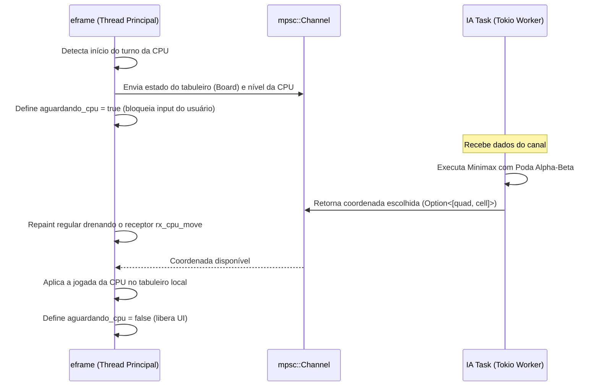
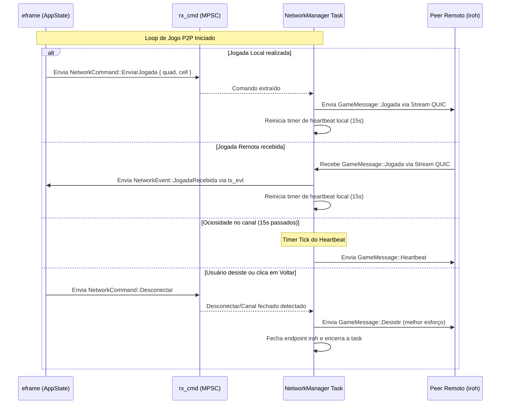
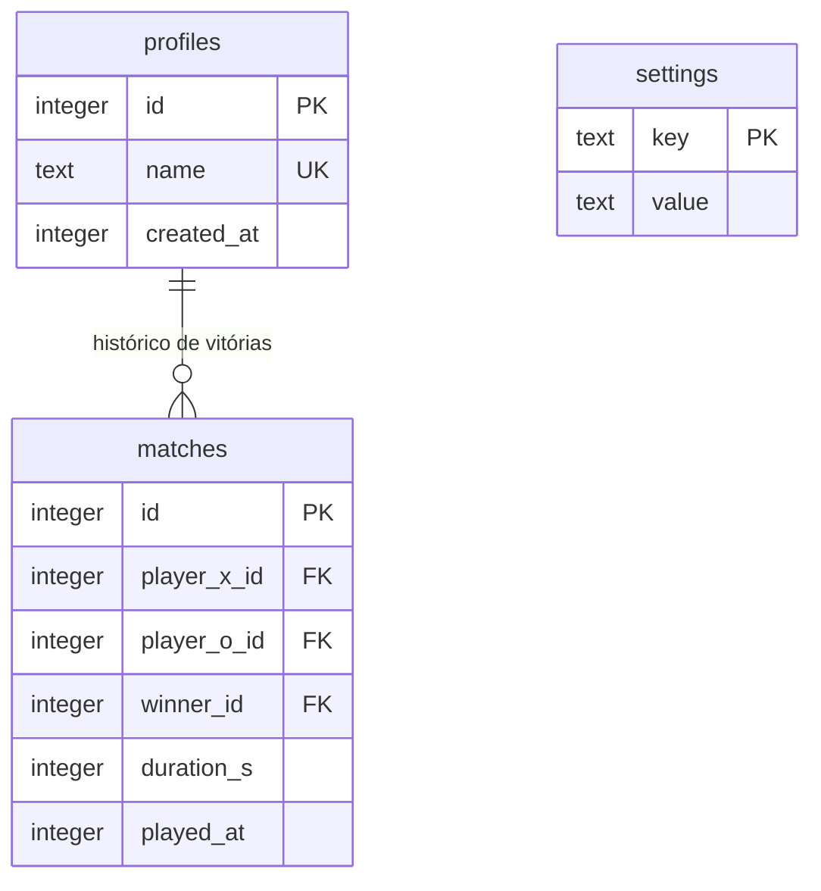

# 📐 Arquitetura do Sistema — Velha 2.0

Este documento descreve a especificação arquitetural do **Velha 2.0 (Ultimate Tic-Tac-Toe)**. Ele detalha as responsabilidades de cada camada, os fluxos de dados do P2P e da IA, a integração do banco de dados e sugere melhorias estruturais de médio a longo prazo para o projeto.

---

## 🏗️ Visão Geral das Camadas

A arquitetura do Velha 2.0 adota uma estrutura em camadas limpas (*Clean Architecture / Onion Architecture* modificada), visando isolar o domínio das regras do jogo da infraestrutura externa (rede, banco de dados e interface gráfica).

```mermaid
graph TD
    %% Nós de Camada
    subgraph UI ["🎨 Camada de Apresentação (egui/eframe)"]
        app["src/app.rs (AppState)"]
        screens["src/ui/screens/* (Telas)"]
        widgets["src/ui/components/* (Widgets/Tema)"]
    end

    subgraph Core ["⚙️ Camada de Domínio (Pure Rust)"]
        game["src/game/mod.rs (Regras)"]
        board["src/game/board.rs (Estruturas)"]
        rules["src/game/rules.rs (Vitória/Empate)"]
        types["src/game/types.rs (Enums/Cell)"]
    end

    subgraph AI ["🤖 Motor de Inteligência Artificial"]
        ai_dispatch["src/ai/levels.rs (Dispatcher)"]
        minimax["src/ai/minimax.rs (Alpha-Beta)"]
        heuristic["src/ai/heuristic.rs (Avaliação)"]
    end

    subgraph Network ["🌐 Infraestrutura P2P (iroh / QUIC)"]
        net_mgr["src/network/manager.rs (Loop Tokio)"]
        net_proto["src/network/protocol.rs (Mensagens)"]
        net_sess["src/network/session.rs (Estados)"]
    end

    subgraph Storage ["💾 Infraestrutura de Persistência (SQLite)"]
        db["src/storage/db.rs (Conexão/WAL)"]
        profile["src/storage/profile.rs (CRUD Perfis)"]
        history["src/storage/history.rs (Estatísticas/Matches)"]
        settings["src/storage/settings.rs (Preferências)"]
    end

    error["src/error.rs (AppError)"]

    %% Relações e Dependências
    app --> screens
    screens --> widgets
    app --> game
    app --> ai_dispatch
    app --> net_mgr
    app --> db
    
    ai_dispatch --> minimax
    minimax --> heuristic
    minimax --> game

    net_mgr --> net_proto
    net_mgr --> net_sess
    
    profile --> db
    history --> db
    settings --> db

    %% Erro transversal
    app -.-> error
    net_mgr -.-> error
    db -.-> error

    classDef uiStyle fill:#1a1b26,stroke:#7aa2f7,stroke-width:2px,color:#c0caf5;
    classDef coreStyle fill:#1e1e2e,stroke:#a6e3a1,stroke-width:2px,color:#cdd6f4;
    classDef aiStyle fill:#2e2c3e,stroke:#cba6f7,stroke-width:2px,color:#cdd6f4;
    classDef netStyle fill:#1e2430,stroke:#ff9e64,stroke-width:2px,color:#cdcecf;
    classDef storeStyle fill:#212328,stroke:#f5c2e7,stroke-width:2px,color:#cdd6f4;
    classDef errorStyle fill:#2a1f26,stroke:#f7768e,stroke-width:2px,color:#dbbfbe;

    class app,screens,widgets UIStyle;
    class game,board,rules,types coreStyle;
    class ai_dispatch,minimax,heuristic aiStyle;
    class net_mgr,net_proto,net_sess netStyle;
    class db,profile,history,settings storeStyle;
    class error errorStyle;
```



---

## 🔄 Fluxos de Comunicação Assíncrona

### 1. Despacho e Execução da IA em Background
Para evitar o travamento da thread gráfica principal (execução em loop reativo síncrono do `eframe`), a IA roda em uma thread paralela do runtime `tokio`.



### 2. Ciclo de Vida da Rede P2P (MPSC & Select Loop)
O gerenciador de rede mantém canais de comunicação bidirecionais assíncronos com a UI. O loop principal do jogo monitora eventos do peer e responde aos inputs locais.



---

## 🛠️ Melhorias Recomendadas de Arquitetura

### 1. Abstração de Jogadores via Trait (`PlayerController`)
- **Problema atual**: O gerenciamento de turnos e jogadas em `src/app.rs` possui ramificações manuais para verificar se o jogador atual é `Local`, `CPU` ou `P2P`. Isso aumenta a complexidade ciclomática do arquivo principal.
- **Solução**: Criar um trait unificado de interface de jogador para encapsular a origem da jogada.

```rust
pub trait PlayerController {
    /// Indica se o controlador está pronto para enviar a jogada.
    fn is_ready(&self, board: &Board) -> bool;
    
    /// Solicita ou recupera a jogada escolhida.
    fn get_move(&mut self, board: &Board) -> Option<(usize, usize)>;
}
```
Implementando este trait para `LocalPlayer`, `CpuPlayer` e `NetworkPlayer`, o motor principal em `app.rs` apenas chamará `controller.get_move(board)` reduzindo acoplamentos.

### 2. Redução de Dependência do `anyhow::Result` (Padronização no `AppError`)
- **Problema atual**: A infraestrutura (`storage` e `network`) ainda usa o `anyhow::Result` genérico para propagar falhas até a UI.
- **Solução**: Estender o enum `AppError` centralizado em `src/error.rs` para capturar erros específicos de rede do `iroh` e do protocolo de transporte (ex. falha no handshake, timeout, ticket inválido). Toda assinatura de função pública nestes módulos deve retornar `Result<T, AppError>`.

### 3. Divisão de Responsabilidades no `AppState` (Padrão Controller/State)
- **Problema atual**: `AppState` atua tanto como a fonte de verdade do estado de visualização do `eframe` (estado dos formulários, botões ativos, transições de tela) quanto como o coordenador de regras de negócio.
- **Solução**: Separar o `AppState` em dois:
  1. `GameCoordinator`: Guarda as regras ativas de jogo, conexões de rede e banco de dados (puro Rust, altamente testável sem UI).
  2. `AppGuiState`: Guarda o estado volátil das telas do `egui` (textos digitados, abas selecionadas, buffers de animação).

### 4. Ciclo de Vida Resiliente da Conexão P2P
- **Problema atual**: O handshake não possui controle estrito de timeout. Se a rede sofrer oscilação logo após abrir a conexão QUIC, o handshake pode travar.
- **Solução**: Envolver o handshake do Host e do Guest em blocos `tokio::time::timeout` de 10 segundos, retornando `AppError::Timeout` caso a negociação não ocorra a tempo.

---

## 📈 Relações de Dados no Banco de Dados SQLite

O esquema de banco de dados local utiliza 3 tabelas fundamentais controladas pelo `src/storage/db.rs`. 



*   **WAL Mode habilitado**: A conexão inicializa o banco em modo Write-Ahead Logging (`PRAGMA journal_mode=WAL`), o que reduz deadlocks e lentidões ao salvar partidas ao mesmo tempo que a UI lê dados do histórico.
*   **Settings Idempotente**: As preferências da aplicação no `settings.rs` utilizam comandos do tipo `INSERT OR REPLACE` garantindo idempotência e prevenindo corrupção de dados ao salvar repetidamente configurações do jogador.
